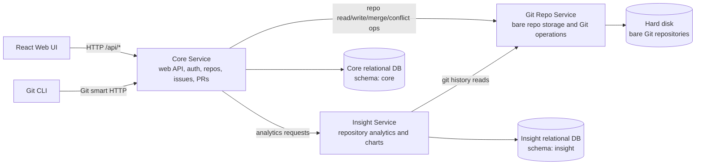

# Synergit Microservice Architecture

Assumption: Synergit has been split into three services: Core, Insight, and Git Repo.

## Components

| Component | Responsibility |
|---|---|
| React Web UI | Browser application for all user workflows. |
| Core Service | Main web service: auth, repo metadata, collaborators, issues, pull requests, labels, stars, and API orchestration. |
| Insight Service | Computes and serves repository analytics such as pulse, contributors, commit activity, and code frequency. |
| Git Repo Service | Owns bare repositories on disk and exposes Git operations over HTTP. |
| Core DB | Relational source of truth for product data. |
| Insight DB | Relational storage for analytics snapshots. |
| Hard disk | Filesystem storage for bare Git repositories. |

## Schema Files

| Service | Schema file |
|---|---|
| Core Service | `core_schema.sql` |
| Insight Service | `insight_schema.sql` |
| Git Repo Service | None; uses hard disk storage. |
