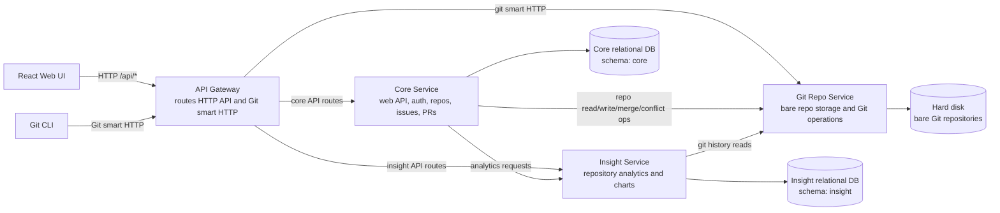

# Synergit Microservice Architecture

Assumption: Synergit has been split into three services: Core, Insight, and Git Repo.

## Components

| Component | Responsibility |
|---|---|
| React Web UI | Browser application for all user workflows. |
| API Gateway | Single public entrypoint; routes web API and Git smart HTTP traffic. |
| Core Service | Main web service: auth, repo metadata, collaborators, issues, pull requests, labels, stars, and API orchestration. |
| Insight Service | Computes and serves repository analytics such as pulse, contributors, commit activity, and code frequency. |
| Git Repo Service | Owns bare repositories on disk and exposes Git operations over HTTP. |
| Core DB | Relational source of truth for product data. |
| Insight DB | Relational storage for analytics snapshots. |
| Hard disk | Filesystem storage for bare Git repositories. |

## Schema Files

| Service | Schema file |
|---|---|
| Core Service | `core_schema.sql` |
| Insight Service | `insight_schema.sql` |
| Git Repo Service | None; uses hard disk storage. |

## Git Smart HTTP vs Standard HTTP API

| Feature | Standard (Dumb) HTTP | Git Smart HTTP |
|---|---|---|
| Efficiency | Very Low. The client often has to download entire massive packfiles even if it only needs one specific object. | High. The server dynamically compresses and sends only the exact data the client is missing. |
| HTTP Requests | High. Requires dozens or hundreds of individual GET requests to discover and fetch objects. | Low. Uses a couple of efficient POST requests to transfer bulk data. |
| Server Requirement | Any basic static web server. | Web server with CGI capability + Git installed. |
| Push Capabilities | Complicated. Pushing requires setting up WebDAV, which is notoriously slow and difficult to configure securely. | Native. Fully supports pushing natively via git-receive-pack with standard authentication. |
| Firewall Friendliness | Excellent (uses ports 80/443). | Excellent (uses ports 80/443). |
