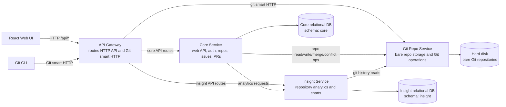

# Synergit Microservice Architecture

Assumption: Synergit has been split into three services: Core, Insight, and Git Repo.

## Components

| Component | Responsibility |
|---|---|
| React Web UI | Browser application for all user workflows. |
| API Gateway | Single public entrypoint; routes web API and Git smart HTTP traffic. |
| Core Service | Main web service: auth, repo metadata, collaborators, issues, pull requests, labels, stars, and API orchestration. |
| Insight Service | Computes and serves repository analytics such as pulse, contributors, commit activity, and code frequency. |
| Git Repo Service | Owns bare repositories on disk and exposes Git operations over HTTP. |
| Core DB | Relational source of truth for product data. |
| Insight DB | Relational storage for analytics snapshots. |
| Hard disk | Filesystem storage for bare Git repositories. |

## Schema Files

| Service | Schema file |
|---|---|
| Core Service | `core_schema.sql` |
| Insight Service | `insight_schema.sql` |
| Git Repo Service | None; uses hard disk storage. |

## Git Smart HTTP vs Standard HTTP API

| Aspect | Standard HTTP API | Git Smart HTTP |
|---|---|---|
| Definition | Application-defined HTTP endpoints. | Git protocol tunneled over HTTP. |
| Request shape | REST-like routes with JSON/query/body contracts. | Fixed Git endpoints such as `info/refs`, `git-upload-pack`, and `git-receive-pack`. |
| Response shape | Usually JSON or simple files. | Git pkt-line and packfile streams. |
| Semantics | Business actions defined by the app. | Git object negotiation, fetch, clone, and push. |
| Server role | Interprets app commands and returns app data. | Speaks Git wire protocol and reads/writes Git objects. |
