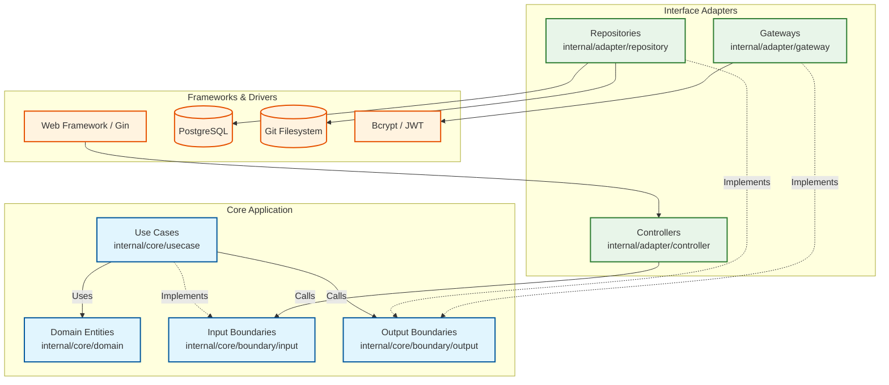

# Synergit Backend Architecture Guidelines

This document outlines the strict adherence to **Robert C. Martin's (Uncle Bob) Clean Architecture** for the Synergit backend. All code must follow these principles to ensure the core business rules remain completely isolated from UI, databases, frameworks, and external agencies.

## 1. Architectural Overview

Clean Architecture revolves around concentric layers. The overriding rule is the **Dependency Rule**: *Source code dependencies must only point inward, toward higher-level policies.*

```text
Frameworks & Drivers (Postgres, Git CLI, Web Server)
  ➔ Interface Adapters (Controllers, Repositories, Gateways)
    ➔ Application Business Rules (Use Cases)
      ➔ Enterprise Business Rules (Entities)
```

### Architecture Diagram



## 2. Layer & Directory Breakdown

To align strictly with Uncle Bob's terminology, the codebase follows this structure:

### 2.1. Entities (`internal/core/domain`)
- **What it is:** Enterprise-wide business rules. These are pure data structures (structs, value objects) and functions that encapsulate the most fundamental business logic.
- **Rules:**
  - MUST NOT import any external libraries, frameworks, database drivers, or HTTP packages.
  - MUST NOT contain any persistence logic or framework-specific tags (e.g., GORM tags are strictly forbidden). JSON tags are acceptable only if strictly required for DTO normalization without leaking HTTP specifics.

### 2.2. Boundaries (`internal/core/boundary`)
- **What it is:** Interfaces that dictate how the Use Cases communicate with the outside layers (Controllers and Gateways).
- **Structure:**
  - `boundary/input/`: Interfaces defining the Use Case boundaries. **Controllers** call these. (e.g., `RepoUseCase`, `AuthUseCase`).
  - `boundary/output/`: Interfaces defining what the Use Cases need from external infrastructure. **Use Cases** call these. (e.g., `RepoGateway`, `GitGateway`).

### 2.3. Use Cases (`internal/core/usecase`)
- **What it is:** Application-specific business rules (the "Interactors"). They orchestrate the flow of data to and from the entities.
- **Rules:**
  - MUST implement the Input Boundary interfaces (`boundary/input/`).
  - MUST only depend on Output Boundary interfaces (`boundary/output/`).
  - MUST NOT know anything about HTTP (e.g., `*gin.Context`) or Databases (e.g., `*sql.DB`).

### 2.4. Adapters (`internal/adapter`)
- **Controllers (`internal/adapter/controller`):** Accept HTTP requests, unpack data, and call the Input Boundaries.
- **Repositories (`internal/adapter/repository`):** Implement the Output Boundaries for data persistence (e.g., Postgres, Local Git).
- **Gateways (`internal/adapter/gateway`):** Implement the Output Boundaries for non-storage external infrastructure or external services (e.g., Security hashing, Analytics generation).
- **Rules:**
  - Controllers MUST ONLY depend on Input Boundaries.
  - Repositories and Gateways MUST ONLY implement Output Boundaries.
  - Controllers MUST NEVER bypass the Use Case layer to call a Repository or Gateway directly.

---

## 3. Current Architectural Violations & Technical Debt

During rapid development, shortcuts were taken that violate Clean Architecture principles. These must be fixed before the microservices migration.

### 💥 Violation 1: Gateways Injected into Controllers
Controllers are bypassing the Use Case layer and talking directly to the database or external systems.
- **Location:** `user_settings_handler.go`
  - *Fault:* Injects the user store directly.
  - *Fault:* Takes raw `*sql.DB` directly (wired in `main.go`). This is a critical framework leak into the adapter layer.
- **Location:** `pr_label_handler.go`
  - *Fault:* Injects concrete structs `*postgres.PullRequestLabelStore` and `*postgres.PullRequestAssigneeStore` instead of depending on an Input Boundary. This violates both Dependency Inversion and the Use Case layer boundary.

### 💥 Violation 2: Missing Input Boundaries
Currently, HTTP handlers depend directly on the concrete use case structs (e.g., `*usecase.RepoService`) instead of abstract Input Boundary interfaces.
- *Why it's wrong:* In Clean Architecture, the boundary between the Interface Adapters and the Use Cases must be an interface. Depending on concrete interactors tightly couples the HTTP layer to the implementation and makes mocking difficult.

### 💥 Violation 3: Legacy Directory Naming
The current codebase uses terms like `adapter/handler/http` and `adapter/repository`, which lean heavily into generic Hexagonal terminology rather than explicit Clean Architecture terms.

---

## 4. Refactoring Action Plan

To restore strict Clean Architecture integrity, the following refactoring plan must be executed (as Part B work):

### Phase 1: Directory Renaming & Structure Alignment
1. Rename `internal/adapter/handler/http` to `internal/adapter/controller`.
2. Keep Postgres database implementations AND Local Git implementations in `internal/adapter/repository`.
3. Move `internal/adapter/security` and `internal/adapter/git_analysis` into `internal/adapter/gateway`.
4. Rename `internal/core/port` to `internal/core/boundary` and split it into `boundary/input/` and `boundary/output/`.

### Phase 2: Interface Boundary Introduction
1. Move all existing `*Repository`, `*Store`, and `*Manager` interfaces into `boundary/output/` (and ideally rename them to `*Gateway`, e.g., `RepoGateway`).
2. Extract Input Boundary interfaces (e.g., `RepoUseCase`, `AuthUseCase`, `PullRequestUseCase`) from the existing `*Service` structs and place them in `boundary/input/`.
3. Update all controllers to depend ONLY on `boundary/input/*UseCase` interfaces.

### Phase 3: Eliminate Controller Bypass (Fixing Violations)
1. **Fix `user_settings_handler.go`:**
   - Remove the direct gateway dependency and `*sql.DB` from the controller.
   - Create a proper `UserSettingsUseCase` (or extend `ProfileUseCase`) that handles the username change logic via the gateway.
2. **Fix `pr_label_handler.go`:**
   - Remove the concrete Postgres dependencies from the controller.
   - Create `PRLabelUseCase` and `PRAssigneeUseCase` (or add methods to `PullRequestUseCase`).
   - The controller must call these Use Cases, and the Use Cases will interact with the Output Boundaries.

### Phase 4: Wire Cleanup
1. Update `cmd/server/main.go` to wire the new directory structure correctly. Concrete Gateways are injected into concrete Use Cases. Concrete Use Cases (as Input Boundaries) are injected into Controllers.

---
*Note: These fixes belong to the Maintainable and Scalable Development (Part B) track. Ensure no SCM correctness (Part A) is broken during this refactoring.*
