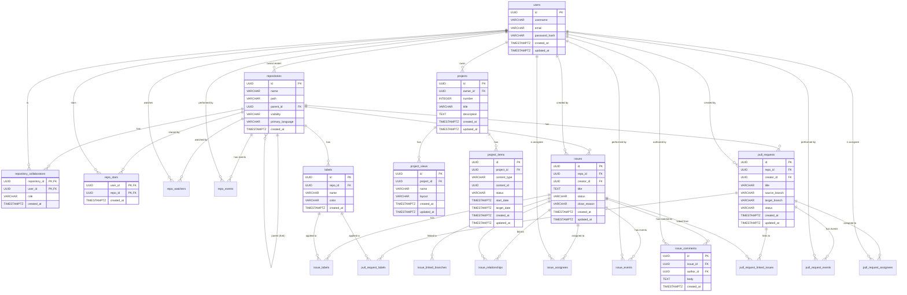

# Core Schema Diagram

```mermaid
erDiagram
    %% Core Entities
    users ||--o{ repositories : "owns/creates"
    repositories ||--o{ repositories : "parent (fork)"
    
    %% Repository relationships
    repositories ||--o{ repository_collaborators : "has"
    users ||--o{ repository_collaborators : "is"
    
    repositories ||--o{ repo_stars : "starred by"
    users ||--o{ repo_stars : "stars"

    repositories ||--o{ repo_watchers : "watched by"
    users ||--o{ repo_watchers : "watches"

    repositories ||--o{ repo_events : "has events"
    users ||--o{ repo_events : "performed by"
    
    %% Issues & PRs
    repositories ||--o{ issues : "has"
    users ||--o{ issues : "created by"
    
    repositories ||--o{ pull_requests : "has"
    users ||--o{ pull_requests : "created by"
    
    %% Labels
    repositories ||--o{ labels : "has"
    issues ||--o{ issue_labels : "has"
    labels ||--o{ issue_labels : "applied to"
    
    pull_requests ||--o{ pull_request_labels : "has"
    labels ||--o{ pull_request_labels : "applied to"
    
    %% Issue Details
    issues ||--o{ issue_assignees : "assigned to"
    users ||--o{ issue_assignees : "is assignee"
    
    issues ||--o{ issue_events : "has events"
    users ||--o{ issue_events : "performed by"
    
    issues ||--o{ issue_comments : "has comments"
    users ||--o{ issue_comments : "authored by"
    
    issues ||--o{ issue_linked_branches : "linked to"
    
    issues ||--o{ issue_relationships : "blocks"
    issues ||--o{ issue_relationships : "is blocked by"
    
    %% PR Details
    pull_requests ||--o{ pull_request_events : "has events"
    users ||--o{ pull_request_events : "performed by"
    
    pull_requests ||--o{ pull_request_assignees : "assigned to"
    users ||--o{ pull_request_assignees : "is assignee"
    
    pull_requests ||--o{ pull_request_linked_issues : "links to"
    issues ||--o{ pull_request_linked_issues : "linked from"
    
    %% Projects
    users ||--o{ projects : "owns"
    projects ||--o{ project_views : "has"
    projects ||--o{ project_items : "has"
    
    %% Table Definitions
    users {
        UUID id PK
        VARCHAR username
        VARCHAR email
        VARCHAR password_hash
        TIMESTAMPTZ created_at
        TIMESTAMPTZ updated_at
    }
    repositories {
        UUID id PK
        VARCHAR name
        VARCHAR path
        UUID parent_id FK
        VARCHAR visibility
        VARCHAR primary_language
        TIMESTAMPTZ created_at
    }
    repository_collaborators {
        UUID repository_id PK, FK
        UUID user_id PK, FK
        VARCHAR role
        TIMESTAMPTZ created_at
    }
    issues {
        UUID id PK
        UUID repo_id FK
        UUID creator_id FK
        TEXT title
        VARCHAR status
        VARCHAR close_reason
        TIMESTAMPTZ created_at
        TIMESTAMPTZ updated_at
    }
    pull_requests {
        UUID id PK
        UUID repo_id FK
        UUID creator_id FK
        VARCHAR title
        VARCHAR source_branch
        VARCHAR target_branch
        VARCHAR status
        TIMESTAMPTZ created_at
        TIMESTAMPTZ updated_at
    }
    labels {
        UUID id PK
        UUID repo_id FK
        VARCHAR name
        VARCHAR color
        TIMESTAMPTZ created_at
    }
    projects {
        UUID id PK
        UUID owner_id FK
        INTEGER number
        VARCHAR title
        TEXT description
        TIMESTAMPTZ created_at
        TIMESTAMPTZ updated_at
    }
    project_views {
        UUID id PK
        UUID project_id FK
        VARCHAR name
        VARCHAR layout
        TIMESTAMPTZ created_at
        TIMESTAMPTZ updated_at
    }
    project_items {
        UUID id PK
        UUID project_id FK
        VARCHAR content_type
        UUID content_id
        VARCHAR status
        TIMESTAMPTZ start_date
        TIMESTAMPTZ target_date
        TIMESTAMPTZ created_at
        TIMESTAMPTZ updated_at
    }
    issue_comments {
        UUID id PK
        UUID issue_id FK
        UUID author_id FK
        TEXT body
        TIMESTAMPTZ created_at
    }
    repo_stars {
        UUID user_id PK, FK
        UUID repo_id PK, FK
        TIMESTAMPTZ created_at
    }
```