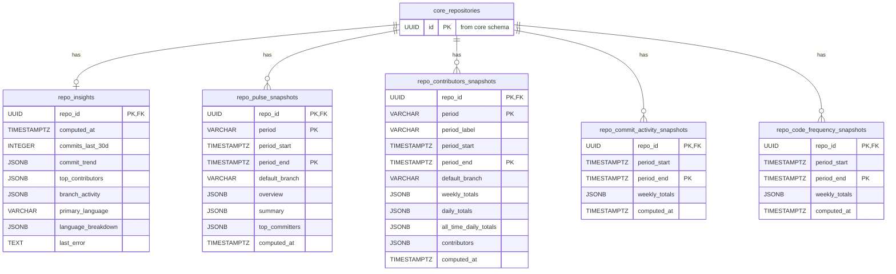

# Insight Schema Diagram

```mermaid
erDiagram
    %% Note: repo_id references core.repositories
    core_repositories ||--o| repo_insights : "has"
    core_repositories ||--o{ repo_pulse_snapshots : "has"
    core_repositories ||--o{ repo_contributors_snapshots : "has"
    core_repositories ||--o{ repo_commit_activity_snapshots : "has"
    core_repositories ||--o{ repo_code_frequency_snapshots : "has"

    core_repositories {
        UUID id PK "from core schema"
    }
    
    repo_insights {
        UUID repo_id PK, FK
        TIMESTAMPTZ computed_at
        INTEGER commits_last_30d
        JSONB commit_trend
        JSONB top_contributors
        JSONB branch_activity
        VARCHAR primary_language
        JSONB language_breakdown
        TEXT last_error
    }
    
    repo_pulse_snapshots {
        UUID repo_id PK, FK
        VARCHAR period PK
        TIMESTAMPTZ period_start
        TIMESTAMPTZ period_end PK
        VARCHAR default_branch
        JSONB overview
        JSONB summary
        JSONB top_committers
        TIMESTAMPTZ computed_at
    }
    
    repo_contributors_snapshots {
        UUID repo_id PK, FK
        VARCHAR period PK
        VARCHAR period_label
        TIMESTAMPTZ period_start
        TIMESTAMPTZ period_end PK
        VARCHAR default_branch
        JSONB weekly_totals
        JSONB daily_totals
        JSONB all_time_daily_totals
        JSONB contributors
        TIMESTAMPTZ computed_at
    }
    
    repo_commit_activity_snapshots {
        UUID repo_id PK, FK
        TIMESTAMPTZ period_start
        TIMESTAMPTZ period_end PK
        JSONB weekly_totals
        TIMESTAMPTZ computed_at
    }
    
    repo_code_frequency_snapshots {
        UUID repo_id PK, FK
        TIMESTAMPTZ period_start
        TIMESTAMPTZ period_end PK
        JSONB weekly_totals
        TIMESTAMPTZ computed_at
    }
```
