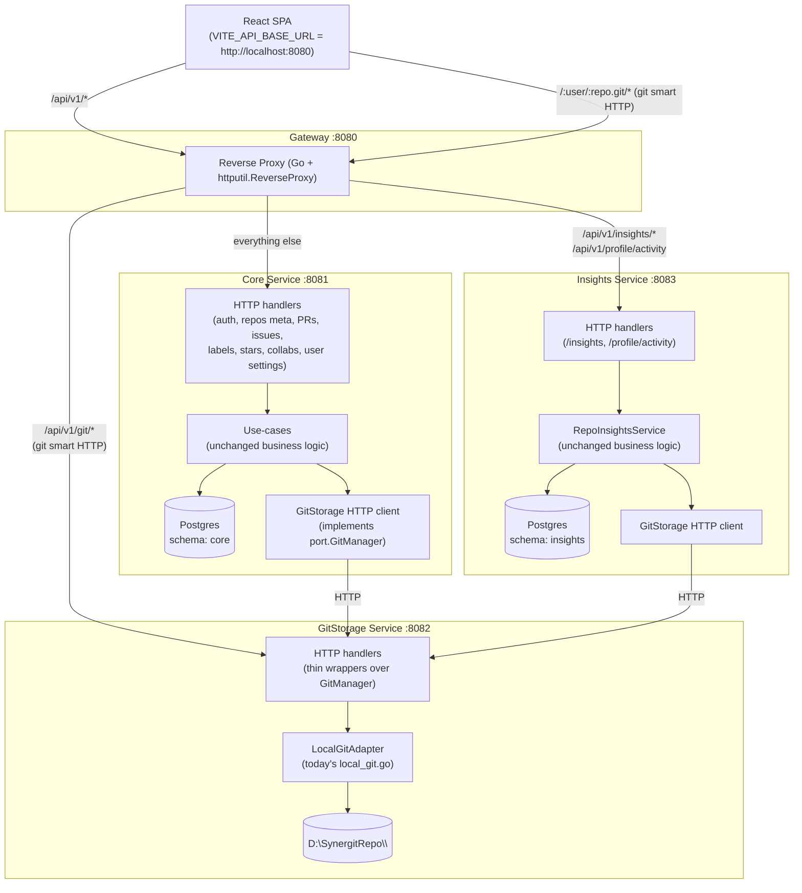

# Implementation Plan — Synergit Microservices Migration (DDD-driven)

## Problem Statement

The current Synergit backend is a single Go monolith following Clean Architecture. All HTTP routes, business logic, git filesystem operations, postgres access, and analytics compute live in one `cmd/server/main.go`. We want to migrate to a **microservices** layout that is faithful to DDD bounded contexts but pragmatic about scope (GitHub's "extract for scale, not for trend" philosophy). The frontend, all business logic, and Clean Architecture inside each service must remain intact.

---

## Requirements (locked from clarifying questions)

| # | Decision |
|---|---|
| 1 | **3 services + 1 gateway:** `gateway`, `core` (majestic-monolith), `gitstorage`, `insights`. |
| 2 | **HTTP/REST** for all communication (frontend↔gateway, gateway↔services, service↔service). |
| 3 | **Single Postgres, schema-per-service:** `core.*`, `git.*` (none today, possibly later), `insights.*`. No cross-schema FKs. |
| 4 | **API Gateway / reverse proxy** in front of services so the React SPA keeps calling one URL. |
| 5 | **Shared HMAC JWT secret** — every service verifies tokens locally, no centralized auth call. |
| 6 | **Monorepo with separate `go.mod` per service** under `backend/services/{gateway,core,gitstorage,insights}/`. |
| 7 | **Strict filesystem ownership: only GitStorage touches `D:\SynergitRepo\`.** Core/Insights call GitStorage's HTTP API. |
| 8 | **Incremental extraction** in 4 phases — each phase ends with the app fully working end-to-end. |
| 9 | **`backend/pkg/synergitkit/`** for cross-cutting concerns + per-service `client/` packages for inter-service calls. |

---

## Background — Findings from the Codebase

**Where work concentrates today (Go files touching the filesystem):**

| File | Hits | Migration target |
|---|---|---|
| `internal/adapter/repository/local_git.go` | 54 | → `services/gitstorage/internal/adapter/repository/local_git.go` (verbatim) |
| `internal/core/usecase/repo_usecase.go` | 29 | stays in **core**; depends on `port.GitManager` (no change) |
| `internal/core/usecase/pull_request_usecase.go` | 17 | stays in **core**; depends on `port.GitManager` |
| `internal/core/usecase/repo_insights_usecase.go` | 5 | moves to **insights**; depends on `port.GitManager` |
| `cmd/server/main.go` | 4 | splits into 4 `cmd/*/main.go` files |
| `internal/adapter/handler/http/user_settings_handler.go` | 4 | stays in **core**; folder-rename becomes an HTTP call to GitStorage |

**Key insight from Clean Architecture: the `port.GitManager` interface (51 methods in `git_port.go`) is the seam.** Today it's implemented by `LocalGitAdapter` (direct filesystem). After migration:

- **In GitStorage:** `LocalGitAdapter` keeps working unchanged — wired into HTTP handlers that mirror each method of the interface.
- **In Core/Insights:** A new `GitStorageHTTPClient` implements the same `port.GitManager` interface but transports calls over HTTP. **Use-cases don't change a single line.**

Same pattern applies to `port.RepoInsightsMetricComputer` (8 methods) — Insights owns the real implementation, Core could in theory call it, but in our split the Insights service owns BOTH the interface consumer (`RepoInsightsService` use-case) AND the implementation, so no HTTP needed there.

**Postgres tables → schema mapping:**

| Current table | New schema | Owning service |
|---|---|---|
| `users` | `core` | core |
| `repositories`, `repository_collaborators` | `core` | core |
| `pull_requests`, `pull_request_events`, `pull_request_labels`, `pull_request_assignees` | `core` | core |
| `issues`, `issue_assignees`, `issue_events`, `issue_comments`, `issue_labels`, `labels` | `core` | core |
| `repo_stars` | `core` | core |
| `repo_insights` | `insights` | insights |

GitStorage owns no tables — it only owns the filesystem.

**Frontend impact:** zero functional. `client.ts` reads `VITE_API_BASE_URL` once and prepends it to every call. With the gateway in front, that URL stays the same; the gateway routes by path prefix.

---

## Proposed Solution

### Target architecture



### New repo layout

```
synergit/
├── frontend/                                     # untouched
├── backend/
│   ├── pkg/
│   │   └── synergitkit/                          # shared cross-cutting (own go.mod)
│   │       ├── go.mod
│   │       ├── auth/                             # JWT verifier, AuthMiddleware
│   │       ├── httpx/                            # error DTOs, request helpers
│   │       └── ids/                              # uuid helpers
│   └── services/
│       ├── gateway/
│       │   ├── go.mod
│       │   ├── cmd/gateway/main.go
│       │   └── internal/proxy/router.go          # path → upstream map
│       ├── core/
│       │   ├── go.mod
│       │   ├── cmd/core/main.go
│       │   ├── internal/core/{domain,port,usecase}/        # SAME as today
│       │   ├── internal/adapter/repository/postgres/        # SAME, schema=core
│       │   ├── internal/adapter/handler/http/               # SAME minus insights
│       │   ├── internal/adapter/security/                   # JWT, bcrypt
│       │   ├── internal/adapter/gitclient/                  # NEW: HTTP client implementing port.GitManager
│       │   └── client/                                      # exported Go client for OTHER services to call core (future-proof, may stay empty for now)
│       ├── gitstorage/
│       │   ├── go.mod
│       │   ├── cmd/gitstorage/main.go
│       │   ├── internal/core/{domain,port,usecase}/         # GitManager interface lives here too (re-exported via client)
│       │   ├── internal/adapter/repository/local_git.go     # MOVED verbatim
│       │   ├── internal/adapter/git_analysis/local_git_language.go
│       │   ├── internal/adapter/handler/http/               # NEW thin wrappers (one handler per GitManager method)
│       │   └── client/                                      # exported HTTP client implementing port.GitManager (consumed by core & insights)
│       └── insights/
│           ├── go.mod
│           ├── cmd/insights/main.go
│           ├── internal/core/{domain,port,usecase}/         # repo_insights_*.go MOVED
│           ├── internal/adapter/repository/postgres/        # postgres_repo_insights.go MOVED, schema=insights
│           ├── internal/adapter/git_analysis/               # commit_activity, language_breakdown, contribution_summary MOVED
│           ├── internal/adapter/handler/http/repo_insights_handler.go  # MOVED
│           └── internal/adapter/gitclient/                  # imports services/gitstorage/client
└── schema.sql                                    # split into per-service migrations under backend/migrations/
```

### Inter-service call examples (after migration)

| Caller | Operation | Target | Notes |
|---|---|---|---|
| Browser | `POST /api/v1/repos` | Gateway → Core | unchanged path; gateway is transparent |
| Core (repo_usecase) | `gitAdapter.InitBareRepo(slug)` | GitStorage `POST /git/repos` | use-case code unchanged; new adapter is HTTP |
| Core (user_settings) | rename folder | GitStorage `POST /git/users/:old/rename` | replaces `os.Rename` |
| Insights (insights_usecase) | `gitAdapter.GetCommits(...)` | GitStorage `GET /git/repos/:slug/commits` | same adapter pattern |
| Frontend git clone | `GET /:user/:repo.git/info/refs` | Gateway → GitStorage | path-prefix routing |

### Auth flow (unchanged from user POV)

1. Frontend `POST /api/v1/auth/login` → Gateway → Core. Core issues HMAC JWT with `JWT_SECRET`.
2. Frontend stores token, sends `Authorization: Bearer ...` on every call.
3. Gateway forwards header untouched.
4. Each service has `synergitkit/auth.Middleware` reading the SAME `JWT_SECRET` and verifying locally — zero extra hops.

---

## Task Breakdown

> Following: *Convert the design into a series of tasks that build each component test-driven, agile, incremental. Each task = working demoable increment. No big jumps. No orphaned code.*

### Phase 0 — Plumbing & shared kit

#### Task 1: Extract `pkg/synergitkit` shared module

- **Objective:** Move `internal/adapter/handler/http/middleware/auth_middleware.go`, `internal/adapter/handler/http/dto/errors.go`, and `request_helpers.go` into a new `backend/pkg/synergitkit/` Go module with sub-packages `auth/`, `httpx/`, `ids/`.
- **Implementation:**
  - Create `backend/pkg/synergitkit/go.mod` (module `synergit/pkg/synergitkit`). Re-export the JWT verifier and `AuthMiddleware`. Add a unit test that signs a token with HMAC and verifies it round-trip.
  - Update the existing monolith's `go.mod` to add `replace synergit/pkg/synergitkit => ../pkg/synergitkit` and import from the new module instead of the local copies. **Delete the originals** so there is exactly one definition.
- **Test:** Run all existing handlers via `go build ./...` + `go vet ./...`. Smoke test login + an authed call against the running monolith.
- **Demo:** App still works end-to-end. `synergitkit` is a real Go module being consumed by the monolith. Login flow proves shared JWT lib works.

---

### Phase 1 — Insert the Gateway in front of the unchanged monolith

#### Task 2: Build minimal pass-through Gateway

- **Objective:** Stand up `backend/services/gateway/` as a new Go module with one binary that listens on `:8080` and reverse-proxies **everything** to the monolith on `:8081`.
- **Implementation:**
  - `cmd/gateway/main.go` uses `net/http/httputil.NewSingleHostReverseProxy`. Read upstream URLs from env: `CORE_URL=http://localhost:8081`. CORS middleware moves here. Health endpoint `GET /health` returns `{"status":"ok","service":"gateway"}`.
  - Move the monolith's port from 8080 → 8081 (via `PORT` env). Frontend `.env` keeps `VITE_API_BASE_URL=http://localhost:8080`.
  - Add `Makefile` targets: `make run-monolith`, `make run-gateway`, `make run-all` (background both).
- **Test:** Write a Go integration test in `gateway` that boots a fake upstream, spins up the gateway, makes an HTTP request, asserts it round-tripped (status code + body + headers).
- **Demo:** Frontend still works exactly as before. `curl http://localhost:8080/api/v1/health` → 200. `curl http://localhost:8081/api/v1/health` → also 200 (monolith direct). Architecture is now `Browser → Gateway → Monolith`.

#### Task 3: Add path-prefix routing rules to Gateway

- **Objective:** Teach gateway to route by path prefix even though all rules currently point to the same upstream — sets up for Phase 2.
- **Implementation:**
  - `internal/proxy/router.go` builds `[]Rule{ {Prefix: "/api/v1/insights", Upstream: insightsURL}, {Prefix: "/api/v1/profile/activity", Upstream: insightsURL}, {Prefix: "/api/v1/git", Upstream: gitstorageURL}, {Default, Upstream: coreURL} }`. Initially all three URLs point to the monolith.
  - Public git smart-HTTP routes (`/:user/:repo_git/info/refs`, `git-upload-pack`, `git-receive-pack`) get a regex matcher routing to `gitstorageURL`.
- **Test:** Table test of `(path, expected_upstream)` pairs.
- **Demo:** Same as Task 2 outwardly, but `curl -v http://localhost:8080/api/v1/insights/...` now demonstrably hits the "insights" upstream rule even though the upstream is still the monolith.

---

### Phase 2 — Extract Insights service (lowest risk: read-mostly, CPU-bound, isolated table)

#### Task 4: Stand up empty Insights service

- **Objective:** Create `backend/services/insights/` as a new Go module that boots, connects to Postgres, exposes `GET /health` on `:8083`, and verifies JWT via `synergitkit/auth`.
- **Implementation:**
  - New `cmd/insights/main.go` with the same env loading + Gin + CORS pattern. Empty `internal/core/`, `internal/adapter/`. Postgres connection sets `search_path=insights,public`.
  - Add migration file `backend/migrations/insights_001_init.sql` that creates the `insights` schema and moves `repo_insights` table into it (`CREATE SCHEMA insights; ALTER TABLE repo_insights SET SCHEMA insights;`).
- **Test:** Boot the binary in CI with a temp Postgres, call `/health`, assert 200.
- **Demo:** `curl http://localhost:8083/health` works. Insights binary is alive but does nothing yet.

#### Task 5: Move RepoInsights domain & use-case into Insights service

- **Objective:** Cut `repo_insights_domain.go`, `repo_insights_port.go`, `repo_insights_usecase.go`, `postgres_repo_insights.go`, `repo_insights_metric_computer.go`, `language_breakdown.go`, `profile_commit_activity.go`, `profile_contribution_summary.go` from the monolith and paste into `services/insights/internal/...` preserving folder structure. Postgres adapter switches to `insights.repo_insights`.
- **Implementation:**
  - Insights service still needs git data — for now, the use-case takes a `port.GitManager` injected as nil-stub (Task 6 wires the real HTTP client).
  - Insights service needs to read repo metadata (the `repositories`, `repository_collaborators`, `pull_requests`, `issues`, `users` tables it currently queries via injected adapters). Decision: **keep the existing per-table postgres adapters but make them read-only** in Insights (reach into `core` schema for reads). This is the one principled deviation from strict schema isolation — Insights reads from `core.*` views/tables but never writes. Document this exception clearly in the service README.
  - Wire `repo_insights_handler.go` into Insights service's `cmd/insights/main.go`. Routes registered: `GET /api/v1/repos/:repo_id/insights`, `POST /api/v1/repos/:repo_id/insights/recompute`, `GET /api/v1/profile/activity`.
  - **Delete** these files from the monolith. Compile error count tells us what still references them; nothing should at this point because handlers were called only from `main.go`.
- **Test:** Insights service unit tests pass (existing tests, if any, follow the move). `go build ./...` clean in both monolith and insights modules.
- **Demo:** Insights service serves `GET /api/v1/repos/<id>/insights` directly — but only the **non-git** parts (cached snapshot reads). Recompute will fail because `GitManager` is nil; that's fine for this task.

#### Task 6: Build GitStorage HTTP client adapter (read-only operations only)

- **Objective:** In `services/gitstorage/client/`, hand-write a Go package that implements `port.GitManager` over HTTP — but for now only the methods Insights calls: `GetCommits`, `GetTree`, `GetBlob`, `GetLanguageBreakdown`, `GetBranches`. Stub the rest with `panic("not implemented")`.
- **Implementation:**
  - `client.NewHTTPClient(baseURL, httpClient)` returns a struct with methods. Each method marshals args to query string / JSON, calls `GET/POST {baseURL}/git/...`, unmarshals response into the `domain.*` types (which we'll need to copy from monolith into a shared `pkg/gitdomain` to avoid circular imports — or duplicate; **decision: duplicate into `services/gitstorage/internal/core/domain/`** and have client return those types; Insights and Core import the client package which re-exports the types).
  - The actual GitStorage HTTP server doesn't exist yet — for this task, point Insights at the **monolith's** equivalent endpoints (the monolith already serves `GET /api/v1/repos/:id/commits` etc.). Translate paths in the client.
- **Test:** Contract test using `httptest.Server` simulating GitStorage responses; assert the client deserializes correctly.
- **Demo:** Insights service can recompute insights end-to-end by talking to the monolith's git endpoints over HTTP. Browser-driven recompute now flows: `Browser → Gateway → Insights → HTTP → Monolith → LocalGitAdapter → disk`.

#### Task 7: Update gateway to route Insights traffic to the Insights service

- **Objective:** Flip the gateway's `INSIGHTS_URL` env from monolith URL to `http://localhost:8083`. Remove the duplicated insights handler from the monolith (now safe — nothing routes to it).
- **Implementation:** env change + delete monolith's insights routes from `main.go`. Re-test all insights paths via gateway.
- **Test:** Manual: trigger insights recompute from frontend, watch logs in Insights service. Automated: gateway integration test asserting `/api/v1/insights/...` → Insights upstream.
- **Demo:** Insights service is fully extracted. Killing the Insights binary breaks insights but leaves login, repos, PRs working. Architecture is now `Browser → Gateway → {Monolith, Insights}`.

---

### Phase 3 — Extract GitStorage service (highest risk: shared filesystem)

#### Task 8: Stand up empty GitStorage service

- **Objective:** New module `services/gitstorage/`, boots on `:8082`, JWT middleware via `synergitkit`, env `GIT_ROOT=D:\SynergitRepo`.
- **Implementation:** `cmd/gitstorage/main.go`. No DB connection (GitStorage owns no DB).
- **Test:** `/health` returns 200.
- **Demo:** Three backend processes running side-by-side (monolith :8081, gitstorage :8082, insights :8083) plus gateway :8080.

#### Task 9: Move `LocalGitAdapter` and expose it over HTTP — read endpoints first

- **Objective:** Move `internal/adapter/repository/local_git.go` and `local_git_language.go` from monolith to `services/gitstorage/internal/adapter/repository/`. Move `internal/core/domain/git_models_domain.go` and `internal/core/port/git_port.go` to `services/gitstorage/internal/core/`. The interface stays the contract.
- **Implementation:**
  - Build thin handlers in `services/gitstorage/internal/adapter/handler/http/` — one handler per `GitManager` method that's a *read*: `GET /git/repos/:slug/tree`, `/blob`, `/commits`, `/commits/:hash`, `/commits/:hash/diff`, `/branches`, `/languages`, `/compare`, `/conflicts`. Each handler binds query/body, calls the use-case-less local adapter (GitStorage doesn't need its own use-case layer — it's pure infrastructure), returns JSON.
  - For `:slug`, encode `username/repo` as `:username/:repo` in the URL.
  - Public git smart HTTP routes (`info/refs`, `upload-pack`, `receive-pack`) move here too, registered at root.
- **Test:** Each endpoint gets an integration test against a temp git repo on disk, comparing JSON output to a golden file.
- **Demo:** `curl http://localhost:8082/git/repos/<user>/<repo>/branches` returns real branch data. The monolith still has its own copy and is the live data source — Task 10 switches over.

#### Task 10: Replace monolith's `LocalGitAdapter` with `GitStorageHTTPClient`

- **Objective:** In the monolith's `cmd/server/main.go`, remove `gitAdapter := repository.NewLocalGitAdapter(gitRoot)`. Replace with `gitAdapter := gitclient.NewHTTPClient("http://localhost:8082")`. The use-cases (`repo_usecase.go`, `pull_request_usecase.go`) keep working because they only know the interface.
- **Implementation:**
  - Implement the read methods of `port.GitManager` in `services/gitstorage/client/` (Insights's client expands to also include them). Switch monolith and Insights to import this same client.
  - **Delete** `internal/adapter/repository/local_git.go` and `local_git_language.go` from the monolith. Compile must still succeed.
- **Test:** Run all existing manual flows — view repo, view branches, view commits, view file content, view diff. All must work.
- **Demo:** Disk reads now go: `Browser → Gateway → Core → HTTP → GitStorage → disk`. Killing gitstorage breaks repo browsing but leaves login working.

#### Task 11: Add write endpoints to GitStorage and switch Core to use them

- **Objective:** Implement remaining `GitManager` methods on GitStorage HTTP server: `InitBareRepo`, `BootstrapRepository`, `DeleteRepository`, `RenameRepository`, `CreateBranch`, `RenameBranch`, `DeleteBranch`, `CommitFileChange`, `CommitFilesChange`, `MergeBranches`, `CreateRevertBranch`, `ResolveConflictsAndCommit`. Plus a new endpoint `POST /git/users/:old/rename` for the username-folder rename we added in user_settings_handler.
- **Implementation:**
  - Each gets a corresponding HTTP handler + a method in the GitStorage HTTP client.
  - The `user_settings_handler.go` in Core stops calling `os.Rename` directly and instead calls the new GitStorage endpoint via the client.
- **Tests:** For each write endpoint, integration test that creates a temp repo, exercises the endpoint, asserts on-disk state.
- **Demo:** Create new repo, push to it via git CLI, rename it, delete it, change username (folder renames) — all working through GitStorage. Phase 3 complete.

---

### Phase 4 — Rename monolith → Core, finalize schema split

#### Task 12: Rename `backend/cmd/server` → `backend/services/core`

- **Objective:** Physical rename of the remaining monolith into the canonical layout. Move `backend/cmd/server/`, `backend/internal/` (what's left after Phases 2–3) into `backend/services/core/`. Give it its own `go.mod` (`module synergit/services/core`).
- **Implementation:** Update import paths. Update Makefile. Update `Procfile` / docker compose if applicable.
- **Test:** `go build ./...` in `services/core/`. End-to-end smoke test: login, create repo, create issue, create PR, merge, view insights — all through gateway.
- **Demo:** Final repo layout matches the target diagram. All four binaries (`gateway`, `core`, `gitstorage`, `insights`) are independent modules. Each can be built, tested, and run alone.

#### Task 13: Split Postgres into `core` schema and document the cross-schema read exception

- **Objective:** Create migration `backend/migrations/core_001_init.sql` that puts all remaining tables (`users`, `repositories`, `repository_collaborators`, `pull_requests`, `pull_request_*`, `issues`, `issue_*`, `labels`, `repo_stars`) into the `core` schema. Update `services/core/internal/adapter/repository/postgres/*.go` to set `search_path=core,public` on connection.
- **Implementation:** Insights service keeps reading from `core.repositories`, `core.users`, `core.issues`, `core.pull_requests` — document this **explicitly** in `services/insights/README.md` as the principled cross-schema read exception (analytics needing source-of-truth tables).
- **Test:** Recreate dev DB from migration files, run full smoke.
- **Demo:** `psql` shows `\dn` listing both `core` and `insights`. All routes still work.

#### Task 14: Write `MICROSERVICES_MIGRATION_PLAN.md` and a final `ARCHITECTURE.md`

- **Objective:** Persist this plan as `MICROSERVICES_MIGRATION_PLAN.md` at repo root (the artifact you originally asked for) and a slimmer `ARCHITECTURE.md` that describes the **final** architecture (no migration history, just the current shape). Include the mermaid diagram, the schema map, the service responsibilities, env vars, and the local-dev `make` commands.
- **Demo:** A new contributor can `git clone`, read `ARCHITECTURE.md`, run `make run-all`, and have all four services up. The migration doc explains the journey for future architectural decisions.

---

**Verification at every phase boundary:** the React frontend works end-to-end with no code change. That is the regression test we hold every task to.
